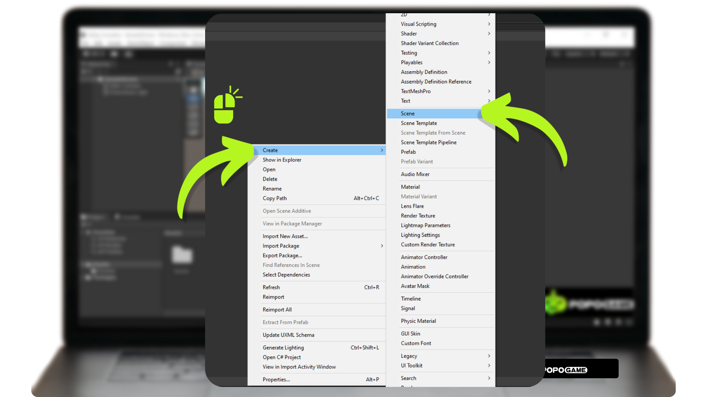

# How to Make the Camera and Character Shake While Walking

We have successfully created simple character movement. The next step is to enhance the realism and dynamics of the game by adding a shaking effect when the character is walking. This shaking feature will provide a more immersive visual effect, as it will affect both the character's GameObject and the camera that follows the character's movements. The shaking intensity will increase when the player sprints by pressing the "Shift" key on the keyboard.

The main difference from the previous approach is that now the Character GameObject will become a Child of the Camera. This means that any movement or position change made by the character will directly affect the position and orientation of the camera. Consequently, the shaking effect added when the character is walking will make the gameplay experience more engaging and realistic.

## Setting Up the Scene

Before starting to create the movement script, the first step is to prepare the scene by organizing the hierarchy and components of each game object. In Unity, organizing the hierarchy is crucial to ensure all game objects are well-structured. Ensure that each game object has the required components such as Rigidbody and Collider, and configure the properties of each component according to the needs. After adding the components, conduct a test to make sure all elements are configured correctly.
Firstly, we need to create a scene to hold all the game objects we need. As usual, right-click on the Project Window -> Create -> Scene. Then, name the created scene and double-click on it to enter.

Next, add the required Game Objects as shown in the image below, and follow the hierarchy of the Game Objects as illustrated.

Function and How to Add the Game Objects Above:
**1. Directional Light:** The Directional Light in Unity simulates sunlight by providing uniform lighting and can be added through GameObject > Light > Directional Light.

**2. 3D Game Object (Knight):** A 3D GameObject in Unity represents a 3D element in the scene, such as characters, environments, or items. To add a 3D object from File Explorer, drag and drop the 3D model file into the Unity Project Window.

**3. Main Camera:** The Main Camera in Unity is the default camera that captures the primary view of the scene. It can be added through GameObject > Camera.

**4. 3D Game Object (Ground):** A 3D GameObject (Plane) in Unity is a basic object representing a flat surface and can be added through GameObject > 3D Object > Plane.

**5. EventSystem:** The EventSystem in Unity is a component that manages input and UI interactions and can be added through GameObject > UI > EventSystem.

## Adding Components

After adding the necessary game objects, the next step is to attach the components required to support movement creation. These components include Rigidbody, which allows for physics simulation like gravity and collision, and Collider, which enables collision detection with other objects. By attaching Rigidbody and Collider, we can ensure that the script created will function as intended, allowing for realistic movement and proper interaction with the game's environment. This step is crucial to ensuring an optimal gameplay experience that aligns with the desired design.

First, we will attach the supporting components to the ground by selecting the ground object, then going to the Inspector window -> Add Component -> and searching for Collider.

Next, we will add the Collider, Rigidbody, and Character Controller components to the character or 3D GameObject. You can add them by pressing the Add Component button -> Search for Collider, Rigidbody, and Character Controller one by one -> then click to add those components as shown in the image below. Make sure to match the component settings as shown in the image below.

## Creating the Movement Script

The final step is to create the movement using a script. First, add the script in your project window by right-clicking in the project window -> Create -> C# Script. Then, double-click on the script to open it in your preferred text editor.

Below is the code for character movement and camera shaking when the player moves their character. We use only one script to control everything. This script includes the logic for character movement and the camera shake effect to provide a more dynamic and engaging gameplay experience. With one script, we ensure that the coordination between character movement and camera shaking works well without requiring many separate adjustments. The script below already includes comments for you to study further and develop further. We also provide the source code, so you don't need to retype the code below. The source code is available in this GitHub Repository.

"After that, attach this script to the Knight Game Object component by pressing the Add Component button -> Script Name -> Then Save -> Press the Play button to test it.

